<div align="center">

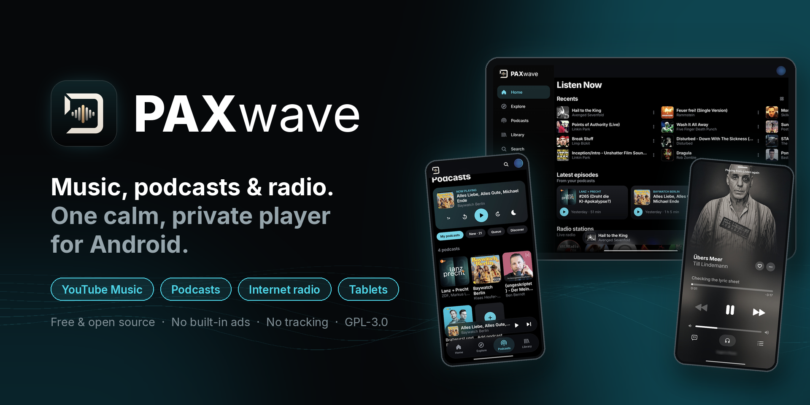

<p><b>Your music, your podcasts and the world's radio in one calm, private Android player.</b></p>

<p>
<a href="https://github.com/PAXakela/PAXwave/releases/latest"></a>
<a href="LICENSE"></a>
<a href="#install"></a>
<a href="https://github.com/PAXakela/PAXwave/actions/workflows/release.yml"></a>
</p>

<p>
<a href="#install"><b>Download</b></a> ·
<a href="#screenshots"><b>Screenshots</b></a> ·
<a href="#built-on-bitchord"><b>Built on BitChord</b></a> ·
<a href="#whats-new"><b>What's new</b></a> ·
<a href="#features"><b>Features</b></a> ·
<a href="#privacy"><b>Privacy</b></a> ·
<a href="#build-from-source"><b>Build</b></a> ·
<a href="#credits"><b>Credits</b></a> ·
<a href="#disclaimer"><b>Disclaimer</b></a> ·
<a href="#licence"><b>Licence</b></a>
</p>

</div>

---

## Screenshots

### 📱 Phone

<table align="center">
  <tr><th colspan="4">🏠 Home &amp; 🎵 Player</th></tr>
  <tr>
    <td align="center">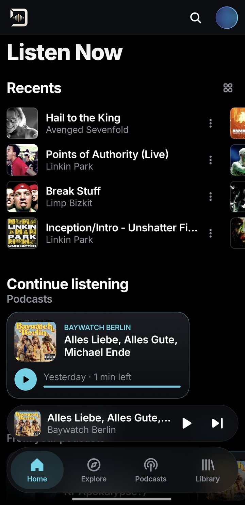<br/><sub>Listen Now</sub></td>
    <td align="center">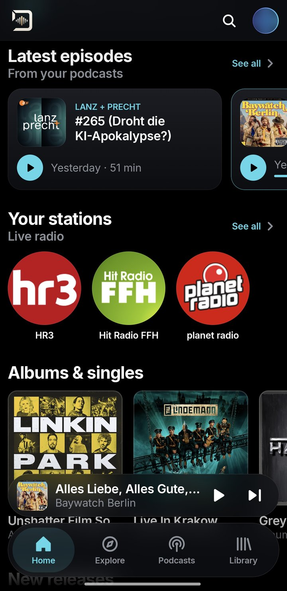<br/><sub>Latest episodes &amp; your stations</sub></td>
    <td align="center">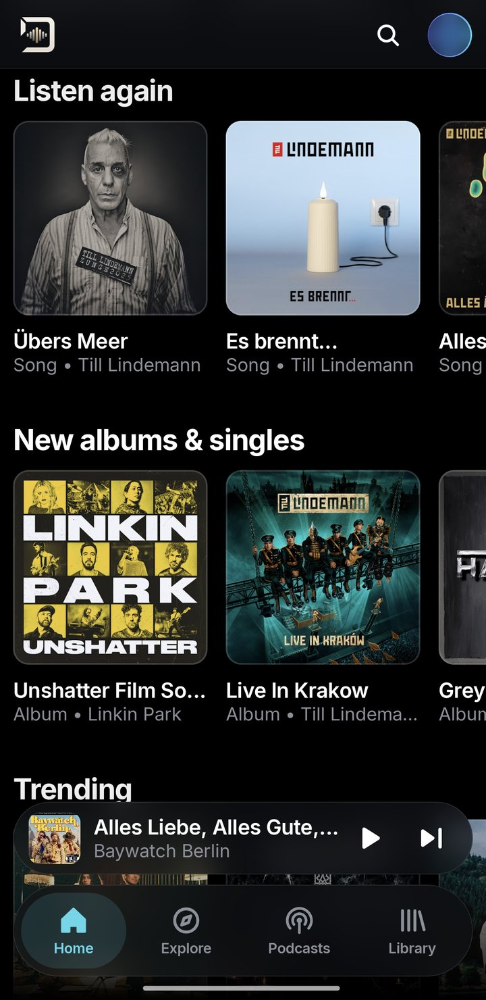<br/><sub>Listen again &amp; new releases</sub></td>
    <td align="center"><br/><sub>Now playing</sub></td>
  </tr>
  <tr><th colspan="4">🧭 Explore &amp; 🎙️ Podcasts</th></tr>
  <tr>
    <td align="center">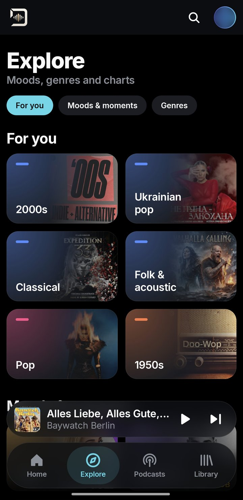<br/><sub>Explore</sub></td>
    <td align="center">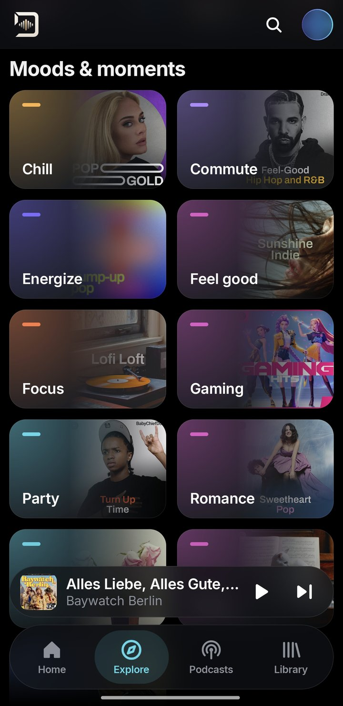<br/><sub>Moods &amp; moments</sub></td>
    <td align="center">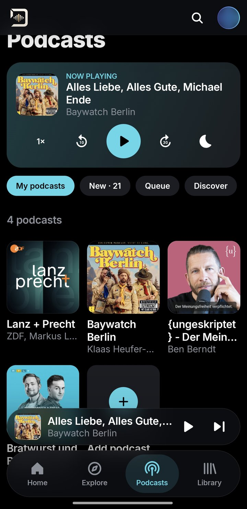<br/><sub>My podcasts</sub></td>
    <td align="center">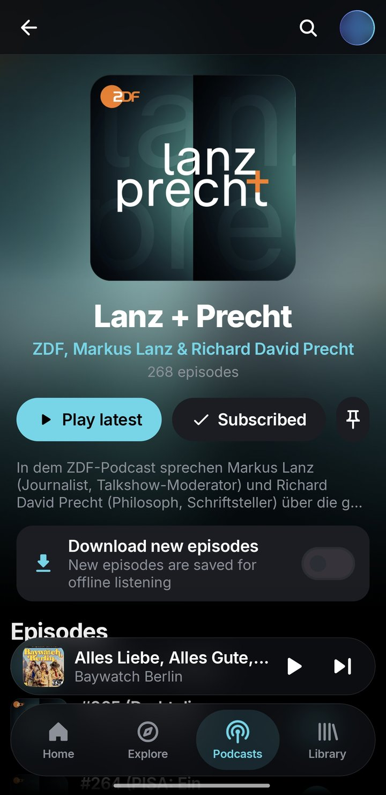<br/><sub>Podcast show</sub></td>
  </tr>
  <tr><th colspan="4">🎙️ Discover &amp; 📚 Library</th></tr>
  <tr>
    <td align="center">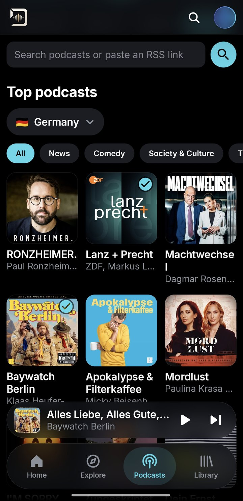<br/><sub>Discover podcasts</sub></td>
    <td align="center">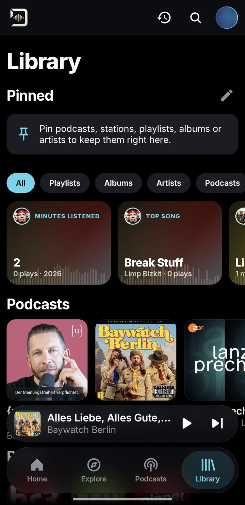<br/><sub>Library &amp; pins</sub></td>
    <td align="center">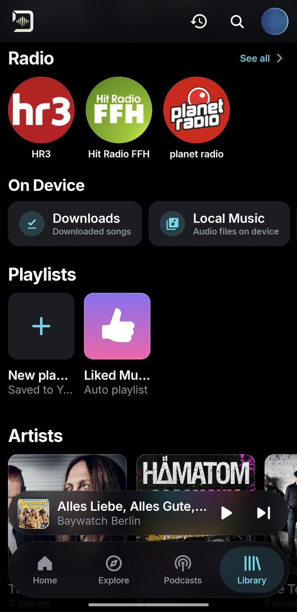<br/><sub>Radio, on device, playlists</sub></td>
    <td align="center">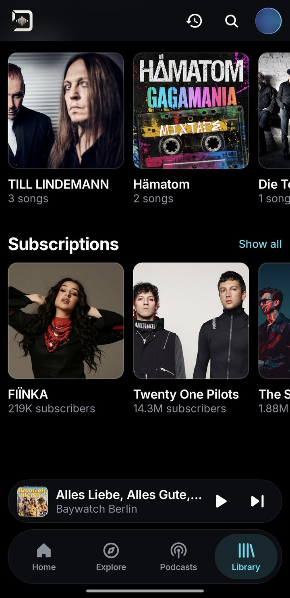<br/><sub>Artists &amp; subscriptions</sub></td>
  </tr>
</table>

### 📱 Tablet

On tablets and unfolded foldables PAXwave switches to a sidebar and wider grids by itself
(or set it under Settings → Appearance → *Tablet layout*).

<table align="center">
  <tr>
    <td align="center">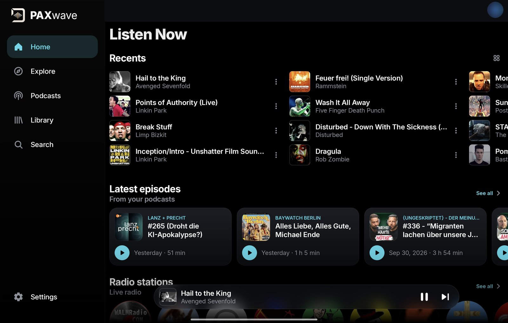<br/><sub>Home</sub></td>
    <td align="center">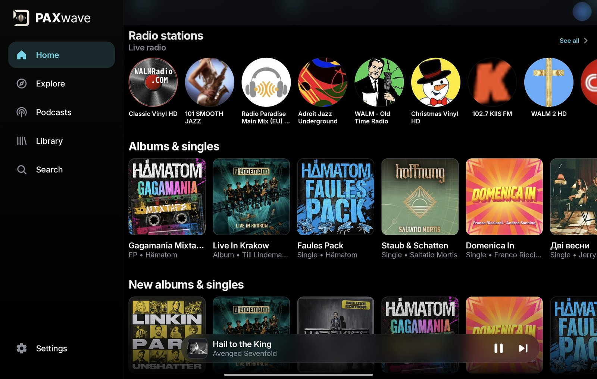<br/><sub>Radio &amp; albums on Home</sub></td>
  </tr>
  <tr>
    <td align="center">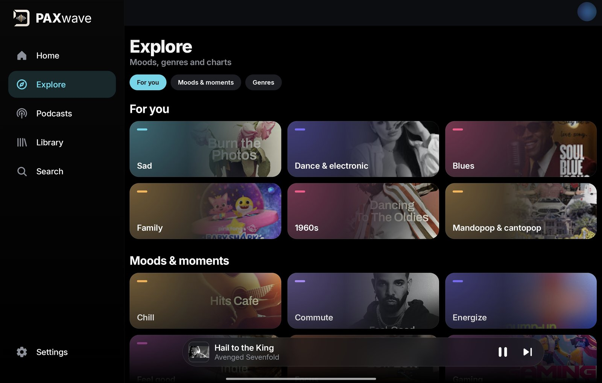<br/><sub>Explore</sub></td>
    <td align="center">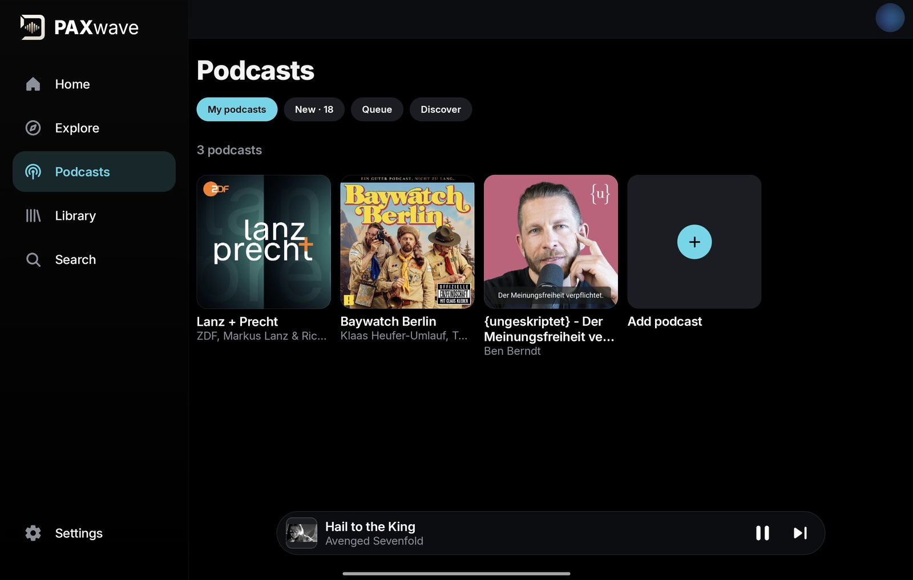<br/><sub>Podcasts</sub></td>
  </tr>
  <tr>
    <td align="center">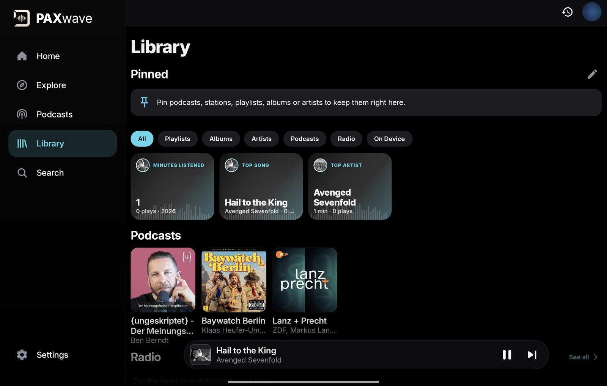<br/><sub>Library</sub></td>
    <td align="center">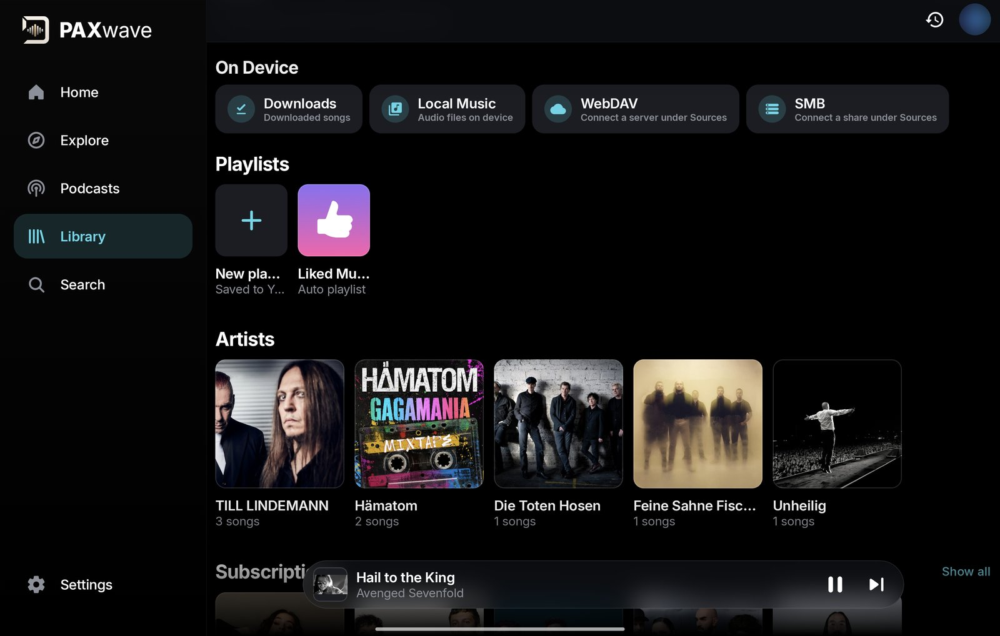<br/><sub>On device, playlists &amp; artists</sub></td>
  </tr>
  <tr>
    <td align="center" colspan="2"><br/><sub>Now playing</sub></td>
  </tr>
</table>

---

## Built on BitChord


**PAXwave is a fork of [BitChord](https://github.com/kushagrasinghx/BitChord)**, the beautiful
open-source YouTube Music client by **[Kushagra Singh](https://github.com/kushagrasinghx)** and
the BitChord community.

<br clear="left"/>

Everything that makes PAXwave sound and feel good as a music player starts with BitChord: the
YouTube Music client, the player and its audio engine, synced lyrics, Automix, Replay, downloads,
the equaliser and much more. PAXwave keeps all of that and builds on top of it with new
features, its own look and a few changes of direction.

### What PAXwave adds and changes

- **Podcasts, built in from scratch:** RSS subscriptions, search, Discover charts by country and
  category, new-episode inbox, queue, podcast-only AutoPlay, resume and played state, downloads,
  per-show auto-download with background refresh, sleep timer with fade-out, speed and skips
- **Internet radio:** the Radio Browser directory, genres, countries, custom stream URLs,
  favourites and live "now playing" titles
- **One search** across music, podcasts and radio, with category filters
- **Tablet mode:** a sidebar instead of the bottom bar and wider grids on tablets and unfolded
  foldables, picked automatically or set by hand
- **Battery settings:** a battery saver that can follow Android's own, Automix analysis only while
  charging, optional preloading, and control over when podcasts are checked in the background
- **A reworked interface:** new Home sections, a Podcasts tab in the navigation, a redesigned
  header, library with pinned favourites, a new Explore page, compact cards and a calm loading
  animation
- **Its own identity:** the PAXwave name and logo, aqua accent colour and the Inter typeface
- **Public, reproducible releases:** every APK is built by GitHub Actions from the tagged source
- **Left out on purpose:** Listen Together (no party server) and the in-app update check

### Thank you, BitChord team ❤️

A huge thank you to **Kushagra Singh** and **every BitChord contributor**. Your work is the
foundation of this app, and PAXwave would simply not exist without it. Thank you for building
something this good and for sharing it with everyone under the GPL.

If you enjoy PAXwave, please **[give BitChord a ⭐](https://github.com/kushagrasinghx/BitChord)**
and support the original project. All credit for the BitChord parts belongs to its authors;
the BitChord name and logo shown here are theirs and are used only to credit them.
PAXwave is an independent fork and is not run or endorsed by the BitChord team.

---

## Why PAXwave

Most of us juggle three apps: one for music, one for podcasts, one for the radio. PAXwave puts
all three into a single player with one queue, one search and one library, and keeps the
design quiet so the music stays in front.

- **No built-in ads, no trackers, no PAXwave account.** PAXwave has no servers of its own and
  never adds advertising of its own. (Podcasts and stations may carry their own; see
  [About ads](#about-ads).)
- **Free and open source** under the GPL-3.0. Every line is in this repository.
- **Every release is built from this source** by GitHub Actions, in public (see [Install](#install)).

---

## What's new

**1.14: Tablet mode**

- On a tablet or an unfolded foldable, PAXwave now uses a **sidebar** down the left edge, with
  labels beside the icons when the screen is wide enough
- Grids for podcasts, radio, Explore and the library **grow with the screen** instead of
  stretching two or three tiles across it, and Settings stays at a readable width
- Chosen **automatically**, or set it yourself under Settings → Appearance → *Tablet layout*

**1.13: Podcasts and radio on the audio chip**

- Podcast episodes and radio stations now play through the phone's own low-power audio chip
  where the device supports it, so the processor can sleep while you listen with the screen off
  (Settings → Battery → *Power-efficient podcasts and radio*)
- The player's own work during playback now runs only when the audio actually needs feeding

**1.12: Much less battery in the background**

- Playing a podcast, station or song with the screen off now keeps the phone asleep far more:
  background timers that woke it several times a second are gone or slowed right down, and
  podcasts and radio skip Automix analysis and lyric look-ups entirely

**1.11: Battery settings**

- New **Battery** section in Settings: a **battery saver** that switches off the heavy extras
  and can turn on by itself with Android's Battery Saver
- Automix song analysis **only while charging**, **preloading** on or off, and how often
  (and on which network and power) **podcasts are checked** in the background

**1.10: New look**

- A **new logo** and app icon
- A redesigned **Explore** page with mood-coloured cards and section chips
- The splash screen is gone; Home now shows a **calm loading animation** while it fills in

See every version on the [Releases](https://github.com/PAXakela/PAXwave/releases) page.

---

## Features

### 🎵 Music (YouTube Music)
- Your YouTube Music library, playlists, mixes, albums and artists (optional sign-in)
- **Automix:** beat-matched transitions between songs, from on-device beat and tempo analysis
- Crossfade, loudness normalisation and skip silence
- **Synced lyrics** from many sources, word by word where available, with **translation**
  and **romanisation**
- Equaliser with balance control, audio-quality choice, USB DAC output
- **Downloads** for offline listening, with quality and Wi-Fi-only settings
- **Replay:** your listening stats and shareable cards, counted only on your phone
- Local music on the phone and from network shares (SMB)
- Home-screen widgets
- Optional scrobbling (Last.fm, ListenBrainz, Libre.fm) and Discord status

### 🎙️ Podcasts
- Subscribe by **RSS link**, by **search** or from **Discover**: top charts by country and
  category
- New-episode inbox and a full episode list per show
- **Episode queue** you can reorder, plus **AutoPlay** of the newest unheard episodes
  (on or off, separate from music)
- **Resume** where you stopped, with played and in-progress states
- **Downloads** and **per-show auto-download** of new episodes, refreshed in the background
- **Sleep timer** with gentle fade-out, playback speed, 10 s back and 30 s forward

### 📻 Internet radio
- Thousands of stations from the community-run [Radio Browser](https://www.radio-browser.info)
  directory
- Browse by genre and country, or add any stream URL yourself
- Favourites and a live **"now playing"** title where the station sends one

### 🔋 Battery
Everything here is a switch or choice under **Settings → Battery**, so you decide how much
PAXwave does in the background.

| Setting | What it does | Default |
| --- | --- | :---: |
| **Battery saver** | Turns off animations, blur, liquid glass and animated cover art, uses the standard refresh rate, pauses Automix analysis, Discord status and automatic podcast downloads, and preloads only the next song. Your own settings return when it is off. | Off |
| ↳ **Follow Android's Battery Saver** | Switches the battery saver on and off together with the system's | On |
| **Analyse songs only while charging** | Automix's on-device beat and vocal analysis waits for a charger and uses a normal crossfade until then | Off |
| **Power-efficient podcasts and radio** | Plays episodes and stations on the phone's low-power audio chip, so the processor can sleep with the screen off (when no equaliser, spatial audio or skip silence is on) | On |
| **Preload upcoming songs** | Instant, gapless playback; turn it off to save data and battery | On |
| **Check for new episodes** | Every 3, 6, 12 or 24 hours, or never | 6 h |
| ↳ **Only on Wi-Fi** | Background podcast checks wait for Wi-Fi | Off |
| ↳ **Only while charging** | Background podcast checks wait for a charger | Off |

Each visual extra (animations, dynamic blur, liquid glass, lyrics blur, animated artwork,
high refresh rate) can also be switched off on its own under **Settings → Appearance** and
**Performance**. Background podcast checks always pause when the battery is low.

### 📱 Tablets and foldables
- A **sidebar** with Home, Explore, Podcasts, Library, Search and Settings: a compact rail on
  a portrait tablet, labelled on a wide screen
- **Wider grids** that fit as many podcasts, stations and Explore cards as the screen holds
- Settings and other list pages kept to a **readable width** in the middle of the screen
- **Automatic** detection, or force the tablet or phone layout in Settings → Appearance

### ✨ Everywhere
- **One search** across music, podcasts and radio, with category filters
- **Pinned favourites** in the library: stations, shows, playlists, albums and artists
- **Explore** moods, genres and charts, with chips to jump straight to a section
- Liquid-glass navigation, a calm black-and-white design with one aqua accent, and the
  [Inter](https://rsms.me/inter/) typeface

---

## Install

1. Open the [**latest release**](https://github.com/PAXakela/PAXwave/releases/latest).
2. Download **`PAXwave-vX.Y.apk`** on your phone and open it.
3. If Android asks, allow your browser or file manager to install apps.

**Needs:** Android 8.0 or newer on a 64-bit phone (practically every phone from the last 8 years).

**Updates:** install the new APK over the old one; your library stays. Every release is
signed with the same PAXwave key.

**Built in public:** each APK is built by [GitHub Actions](https://github.com/PAXakela/PAXwave/actions/workflows/release.yml)
directly from the source at that release's tag. The build log is public, so anyone can check
that the APK comes from exactly this code.

---

## Privacy

- **No built-in ads, no analytics, no tracking libraries.** PAXwave has no servers and no account.
- **Your data stays on your phone:** library, podcast subscriptions, listening stats (Replay),
  settings and downloads.
- PAXwave connects **directly** to the services it needs, and only for what you use:
  YouTube Music for music, the podcast feeds you subscribe to, Apple's public podcast directory
  for podcast search and charts, Radio Browser and the stations you play, and lyrics providers
  when you open lyrics.
- Scrobbling and Discord status only run if you sign in to them.
- You decide how much PAXwave does in the background: see [Battery](#-battery).

### About ads

PAXwave itself contains **no advertising, no ad SDKs and no tracking**, and never will. What you
hear, though, comes straight from other people's content:

- **Music (YouTube Music):** PAXwave plays the audio stream directly instead of using YouTube's
  own player, so music normally plays **without YouTube's ads**. This is not guaranteed: it
  depends on how YouTube delivers its service, which can change at any time.
- **Podcasts:** many shows have ads or sponsor messages **recorded into the episode** by the
  publisher. They are part of the audio file itself, so PAXwave plays them like the rest of the
  episode and cannot remove them.
- **Radio:** stations broadcast their **own ads and announcements** in the live stream, just as
  on any other radio. PAXwave plays the stream as it is sent.

---

## Build from source

You need JDK 21 and the Android SDK.

```bash
git clone https://github.com/PAXakela/PAXwave.git
cd PAXwave
echo "sdk.dir=/path/to/android-sdk" > local.properties
./gradlew assembleProdRelease
```

The APKs land in `app/build/outputs/apk/prod/release/`. Without a signing key they come out
unsigned. For a signed build, put `keystore.properties` and the keystore in the project root
(both are git-ignored; see [`keystore.properties.example`](keystore.properties.example)).

---

## Credits

PAXwave stands on the work of many people. Thank you all. ❤️

### Based on

| Project | By | Licence | Used for |
|---|---|---|---|
| [**BitChord**](https://github.com/kushagrasinghx/BitChord) | Kushagra Singh & contributors | GPL-3.0 | The app PAXwave is built on: YouTube Music client, player, lyrics, Automix, Replay |

BitChord contributors: [kushagrasinghx](https://github.com/kushagrasinghx), [Galaxyyss](https://github.com/Galaxyyss), [NeoTurcios](https://github.com/NeoTurcios), [hongducdev](https://github.com/hongducdev), [kmmiio99o](https://github.com/kmmiio99o), [byburak3525](https://github.com/byburak3525), [penetratorcwl](https://github.com/penetratorcwl), [nitinbhat972](https://github.com/nitinbhat972), [AbhiTheModder](https://github.com/AbhiTheModder), [AngelCas04](https://github.com/AngelCas04), [MaverickRox](https://github.com/MaverickRox), [aryasarukkai](https://github.com/aryasarukkai), [Eful97](https://github.com/Eful97), [chaudharyjatin115](https://github.com/chaudharyjatin115), [bazilbycom](https://github.com/bazilbycom), [BernoldM](https://github.com/BernoldM), [Elitenotavailable](https://github.com/Elitenotavailable), [InfantAjith96](https://github.com/InfantAjith96), [SHUBH-snippet](https://github.com/SHUBH-snippet), [yxyydev](https://github.com/yxyydev)

### GPL and AGPL projects

| Project | By | Licence | Used for |
|---|---|---|---|
| [NewPipe Extractor](https://github.com/TeamNewPipe/NewPipeExtractor) | Team NewPipe | GPL-3.0 | Reading YouTube streams |
| [InnerTubeX](https://github.com/MetrolistGroup/innertubex) | Metrolist | GPL-3.0 | YouTube Music API client |
| [Echo Music](https://github.com/EchoMusicApp/Echo-Music) | EchoMusicApp | GPL-3.0 | Glass navigation bar and mini player |
| [Convx](https://github.com/cosmictaserdev-creator/Convx) | cosmictaserdev-creator | GPL-3.0 | Overscroll effect and addon runtime |
| [Kizzy](https://github.com/dead8309/Kizzy) | dead8309 | GPL-3.0 | Discord status |
| [Orchard](https://github.com/SFG5453/Orchard) | SFG545 | AGPL-3.0 | Beat, tempo and track analysis for Automix |

### Other open-source projects

| Project | By | Licence | Used for |
|---|---|---|---|
| [am-lyrics](https://github.com/binimum/am-lyrics) | binimum | MPL-2.0 | Lyrics animation |
| [Beat This!](https://github.com/CPJKU/beat_this) | CP JKU | MIT | Beat-tracking model |
| [Open-Unmix](https://github.com/sigsep/open-unmix-pytorch) | sigsep | MIT | Vocal-separation model |
| [decent-player](https://github.com/Ma145/decent-player) | Ma145 | MIT | USB audio output |
| [BgUtils](https://github.com/LuanRT/BgUtils) | LuanRT | MIT | YouTube playback tokens |
| [backdrop](https://github.com/Kyant0/backdrop) | Kyant0 | Apache-2.0 | Liquid-glass effects |
| [compose-floating-tab-bar](https://github.com/elyesmansour/compose-floating-tab-bar) | Elyes Mansour | Apache-2.0 | Floating tab bar |
| [Media3 / ExoPlayer](https://github.com/androidx/media) | Google | Apache-2.0 | Audio playback |
| [Jetpack Compose & AndroidX](https://developer.android.com/jetpack) | Google | Apache-2.0 | User interface |
| [Kotlin, kotlinx](https://kotlinlang.org) & [Ktor](https://ktor.io) | JetBrains | Apache-2.0 | Language and networking |
| [OkHttp](https://square.github.io/okhttp/) | Square | Apache-2.0 | Networking |
| [Coil](https://coil-kt.github.io/coil/) | Coil contributors | Apache-2.0 | Images |
| [Haze](https://github.com/chrisbanes/haze) | Chris Banes | Apache-2.0 | Blur effects |
| [ONNX Runtime](https://onnxruntime.ai) | Microsoft | MIT | Running the analysis models |
| [QuickJS-kt](https://github.com/dokar3/quickjs-kt) | dokar3 | Apache-2.0 | JavaScript for addons |
| [Mozilla Rhino](https://github.com/mozilla/rhino) | Mozilla | MPL-2.0 | JavaScript for stream extraction |
| [jsoup](https://jsoup.org) | Jonathan Hedley | MIT | HTML parsing |
| [nanojson](https://github.com/TeamNewPipe/nanojson) | Team NewPipe / mmastrac | MIT / Apache-2.0 | JSON parsing |
| [SMBJ](https://github.com/hierynomus/smbj) | Hierynomus | Apache-2.0 | Network shares |
| [ZXing](https://github.com/zxing/zxing) | ZXing authors | Apache-2.0 | QR codes |
| [compose-richtext](https://github.com/halilozercan/compose-richtext) | halilozercan | Apache-2.0 | Formatted text |
| [Protocol Buffers](https://protobuf.dev) | Google | BSD-3-Clause | Data encoding |
| [JSR-305](https://code.google.com/archive/p/jsr-305/) | FindBugs | BSD-3-Clause | Code annotations |
| [Inter](https://rsms.me/inter/) | Rasmus Andersson | OFL-1.1 | Typeface |

### Services

[Radio Browser](https://www.radio-browser.info) (community radio directory) ·
[Apple Podcasts directory](https://podcasts.apple.com) (podcast search and charts) ·
podcast feeds (© their creators) · YouTube Music · lyrics providers such as
[LRCLIB](https://lrclib.net).

The full list is also in the app under **Settings → About PAXwave** and in [`NOTICE`](NOTICE).
The complete licence texts and copyright notices of every bundled component are in
[`THIRD_PARTY_LICENSES.txt`](THIRD_PARTY_LICENSES.txt), and in the app under
**About PAXwave → Open-source licences**.

---

## Disclaimer

PAXwave is an independent, community-made, third-party player. It is **not associated with**
Google LLC, YouTube or YouTube Music, Apple, Deezer, Telegram, Radio Browser, or any podcast
publisher or radio station, nor with any of their parent companies.

- **No hosted media:** PAXwave does not host, upload or store any music, podcasts or radio
  streams. It is only a player: it plays files stored on your own device and streams media
  directly from public services, public feeds and stations, or services you sign in to yourself.
- **Your responsibility:** PAXwave is made for personal, educational and research use. You are
  responsible for using it in line with the copyright laws of your country and the terms of the
  services you use, including YouTube's Terms of Service.
- **No guarantees:** PAXwave adds no ads of its own and aims for a clean listening experience,
  but it **does not guarantee an ad-free experience**. Podcasts and radio stations may include
  their own ads within the episode or broadcast, and third-party services such as YouTube Music
  may change how they work, or stop working with PAXwave, at any time (see [About ads](#about-ads)).
- **Copyleft:** PAXwave is free software under the GPL-3.0. Anyone may share, modify or even sell
  copies, but every copy must come with its complete source code under the same licence.

> [!IMPORTANT]
> PAXwave is not affiliated with, endorsed by or connected to YouTube, Google or Apple in any
> way. Use it at your own discretion.

---

## Licence


PAXwave is free software: you can redistribute it and/or modify it under the terms of the
**GNU General Public License, version 3** (GPL-3.0) as published by the Free Software
Foundation. It is distributed in the hope that it will be useful, but **without any warranty**,
without even the implied warranty of merchantability or fitness for a particular purpose.
See [`LICENSE`](LICENSE) for the full text.

PAXwave includes open-source components under their own licences (GPL-3.0, AGPL-3.0, Apache-2.0,
MIT, BSD, MPL-2.0 and OFL-1.1), all compatible with the GPL-3.0. Their full licence texts and
copyright notices are in [`THIRD_PARTY_LICENSES.txt`](THIRD_PARTY_LICENSES.txt), a summary is in
[`NOTICE`](NOTICE), and both ship inside the app under **About PAXwave → Open-source licences**.
See [Credits](#credits) for the list of projects.

All trademarks belong to their owners.
