<div align="center">

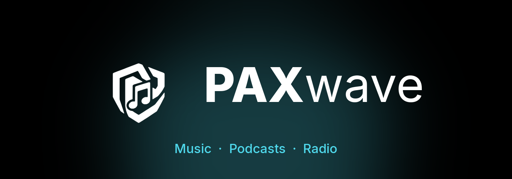

<p><b>Your music, your podcasts and the world's radio in one calm, private Android player.</b></p>

<p>
<a href="https://github.com/PAXakela/PAXwave/releases/latest"></a>
<a href="LICENSE"></a>
<a href="#install"></a>
<a href="https://github.com/PAXakela/PAXwave/actions/workflows/release.yml"></a>
</p>

<p>
<a href="#install"><b>Download</b></a> ·
<a href="#features"><b>Features</b></a> ·
<a href="#screenshots"><b>Screenshots</b></a> ·
<a href="#privacy"><b>Privacy</b></a> ·
<a href="#build-from-source"><b>Build</b></a> ·
<a href="#credits"><b>Credits</b></a> ·
<a href="#licence"><b>Licence</b></a>
</p>

</div>

---

## Why PAXwave

Most of us juggle three apps: one for music, one for podcasts, one for the radio. PAXwave puts
all three into a single player with one queue, one search and one library, and keeps the
design quiet so the music stays in front.

- **No ads, no trackers, no PAXwave account.** PAXwave has no servers of its own.
- **Free and open source** under the GPL-3.0. Every line is in this repository.
- **Every release is built from this source** by GitHub Actions, in public (see [Install](#install)).

---

## Features

### 🎵 Music (YouTube Music)
- Your YouTube Music library, playlists, mixes, albums and artists (optional sign-in)
- **Automix:** beat-matched transitions between songs, from on-device beat and tempo analysis
- Crossfade, loudness normalisation and skip silence
- **Synced lyrics** from many sources, word by word where available, with **translation**
  and **romanisation**
- Equaliser with balance control, audio-quality choice, USB DAC output
- **Downloads** for offline listening, with quality and Wi-Fi-only settings
- **Replay:** your listening stats and shareable cards, counted only on your phone
- Local music on the phone and from network shares (SMB)
- Home-screen widgets
- Optional scrobbling (Last.fm, ListenBrainz, Libre.fm) and Discord status

### 🎙️ Podcasts
- Subscribe by **RSS link**, by **search** or from **Discover**: top charts by country and
  category
- New-episode inbox and a full episode list per show
- **Episode queue** you can reorder, plus **AutoPlay** of the newest unheard episodes
  (on or off, separate from music)
- **Resume** where you stopped, with played and in-progress states
- **Downloads** and **per-show auto-download** of new episodes, refreshed in the background
- **Sleep timer** with gentle fade-out, playback speed, 10 s back and 30 s forward

### 📻 Internet radio
- Thousands of stations from the community-run [Radio Browser](https://www.radio-browser.info)
  directory
- Browse by genre and country, or add any stream URL yourself
- Favourites and a live **"now playing"** title where the station sends one

### ✨ Everywhere
- **One search** across music, podcasts and radio, with category filters
- **Pinned favourites** in the library: stations, shows, playlists, albums and artists
- Liquid-glass navigation, a calm black-and-white design with one aqua accent, and the
  [Inter](https://rsms.me/inter/) typeface

---

## Screenshots

<table align="center">
  <tr><th colspan="4">🎵 Music</th></tr>
  <tr>
    <td align="center">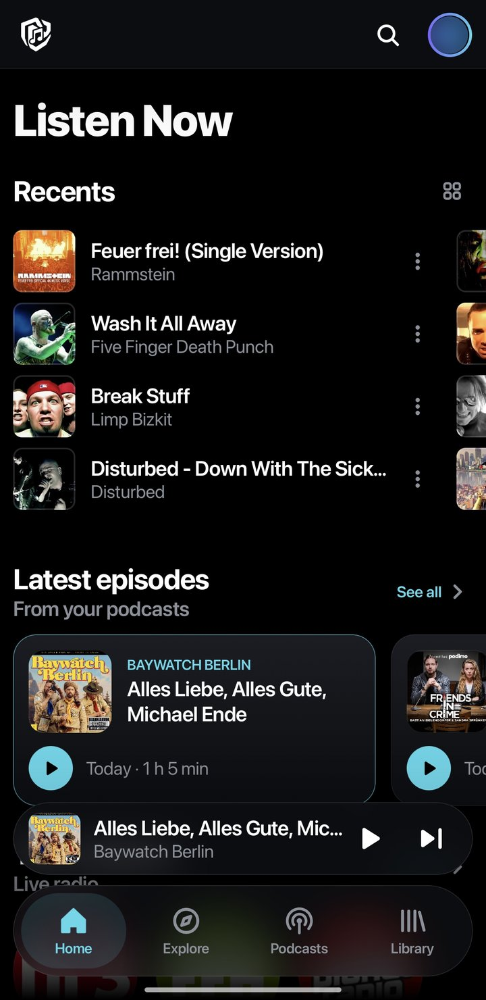<br/><sub>Home</sub></td>
    <td align="center">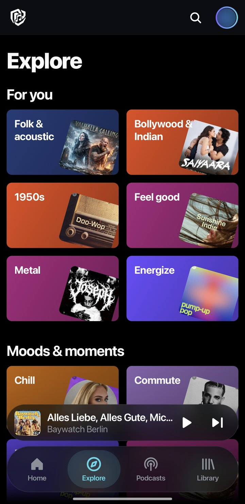<br/><sub>Explore</sub></td>
    <td align="center">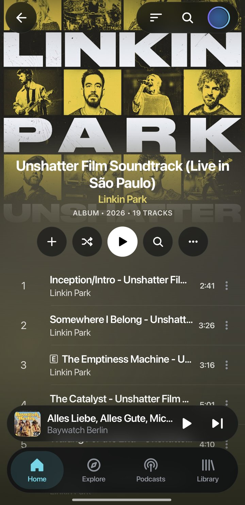<br/><sub>Album</sub></td>
    <td align="center">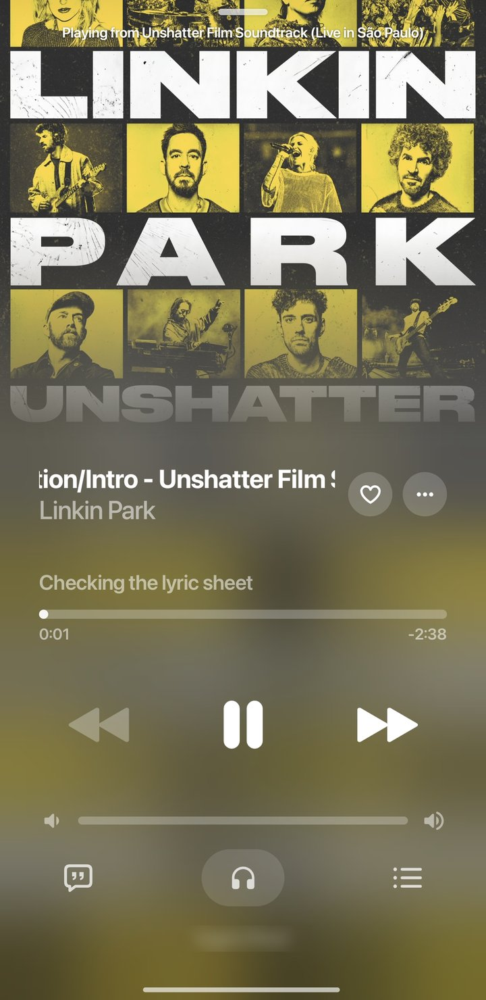<br/><sub>Now playing</sub></td>
  </tr>
  <tr><th colspan="4">🎙️ Podcasts &amp; 📻 Radio</th></tr>
  <tr>
    <td align="center">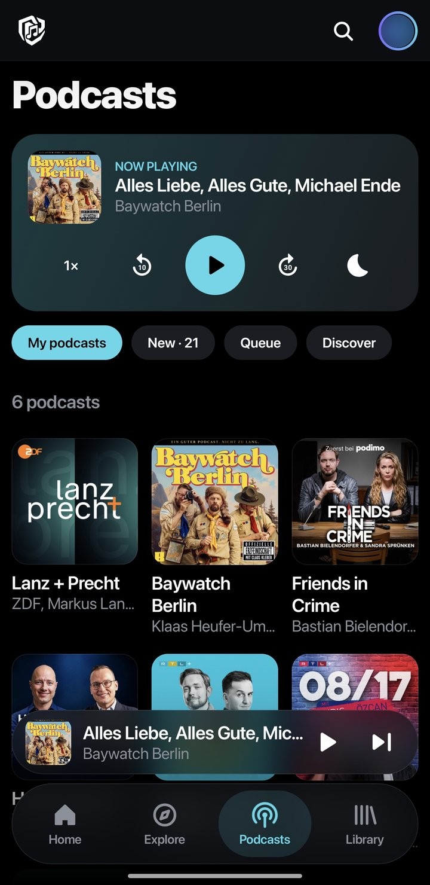<br/><sub>Podcasts</sub></td>
    <td align="center">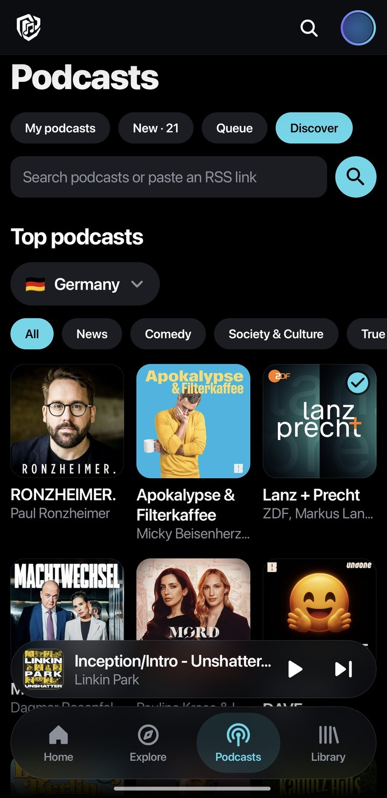<br/><sub>Discover</sub></td>
    <td align="center">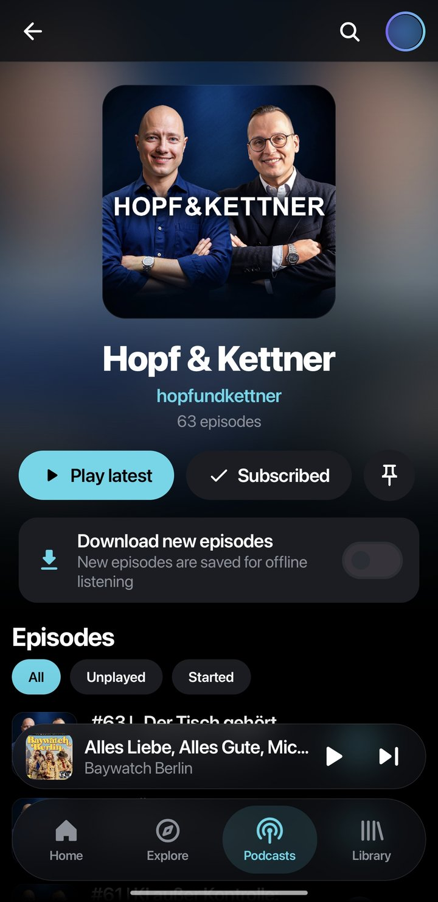<br/><sub>Podcast show</sub></td>
    <td align="center">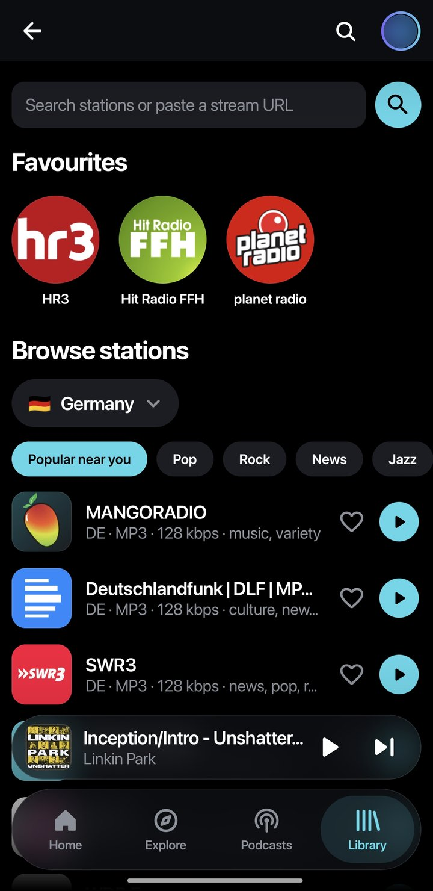<br/><sub>Radio</sub></td>
  </tr>
  <tr><th colspan="4">📚 Library</th></tr>
  <tr>
    <td align="center">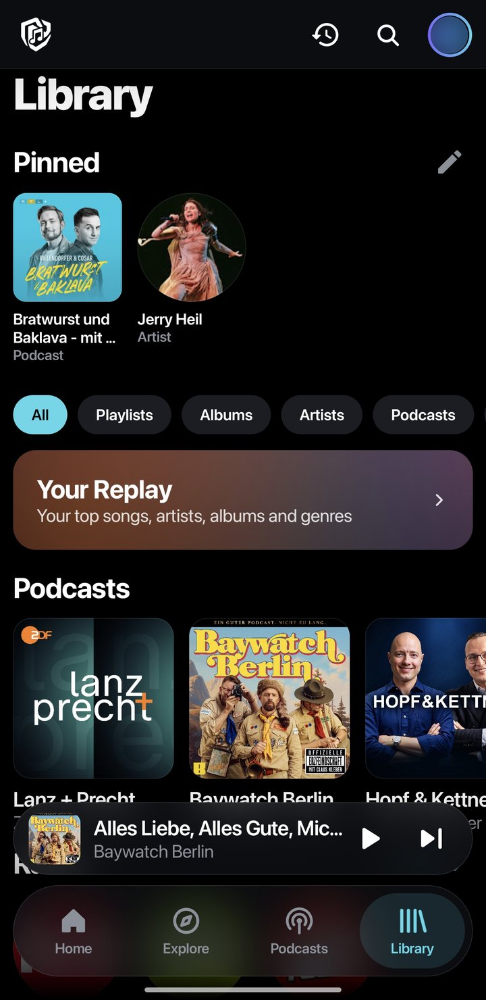<br/><sub>Library &amp; pins</sub></td>
    <td align="center">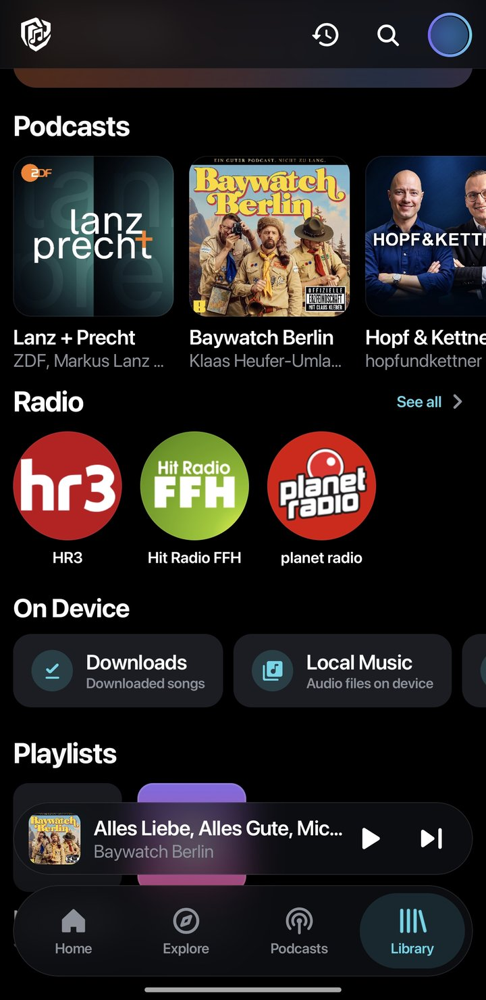<br/><sub>Podcasts, radio, on device</sub></td>
    <td align="center">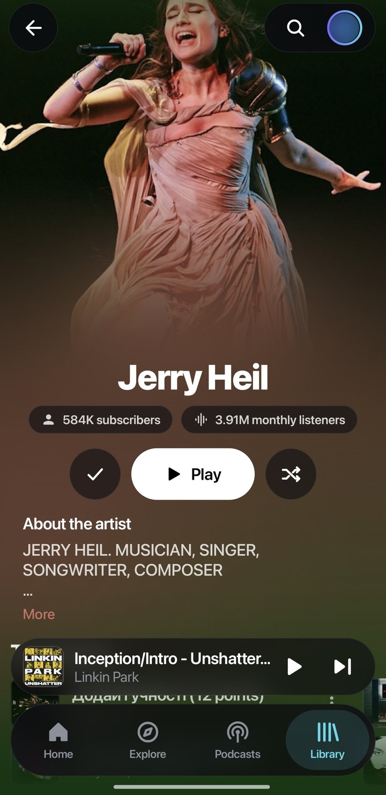<br/><sub>Artist</sub></td>
    <td align="center">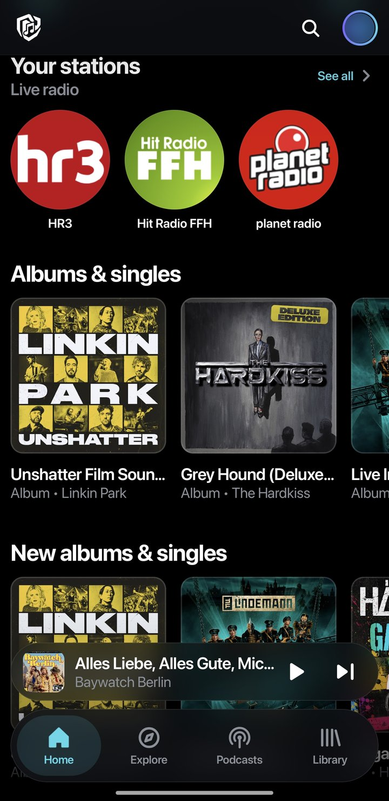<br/><sub>Your stations on Home</sub></td>
  </tr>
</table>

---

## Install

1. Open the [**latest release**](https://github.com/PAXakela/PAXwave/releases/latest).
2. Download **`PAXwave-vX.Y.apk`** on your phone and open it.
3. If Android asks, allow your browser or file manager to install apps.

**Needs:** Android 8.0 or newer on a 64-bit phone (practically every phone from the last 8 years).

**Updates:** install the new APK over the old one; your library stays. Every release is
signed with the same PAXwave key.

**Built in public:** each APK is built by [GitHub Actions](https://github.com/PAXakela/PAXwave/actions/workflows/release.yml)
directly from the source at that release's tag. The build log is public, so anyone can check
that the APK comes from exactly this code.

---

## Privacy

- **No ads, no analytics, no tracking libraries.** PAXwave has no servers and no account.
- **Your data stays on your phone:** library, podcast subscriptions, listening stats (Replay),
  settings and downloads.
- PAXwave connects **directly** to the services it needs, and only for what you use:
  YouTube Music for music, the podcast feeds you subscribe to, Apple's public podcast directory
  for podcast search and charts, Radio Browser and the stations you play, and lyrics providers
  when you open lyrics.
- Scrobbling and Discord status only run if you sign in to them.

---

## Build from source

You need JDK 21 and the Android SDK.

```bash
git clone https://github.com/PAXakela/PAXwave.git
cd PAXwave
echo "sdk.dir=/path/to/android-sdk" > local.properties
./gradlew assembleProdRelease
```

The APKs land in `app/build/outputs/apk/prod/release/`. Without a signing key they come out
unsigned. For a signed build, put `keystore.properties` and the keystore in the project root
(both are git-ignored; see [`keystore.properties.example`](keystore.properties.example)).

---

## Credits

PAXwave stands on the work of many people. Thank you all. ❤️

### Based on

| Project | By | Licence | Used for |
|---|---|---|---|
| [**BitChord**](https://github.com/kushagrasinghx/BitChord) | Kushagra Singh & contributors | GPL-3.0 | The app PAXwave is built on: YouTube Music client, player, lyrics, Automix, Replay |

BitChord contributors: [kushagrasinghx](https://github.com/kushagrasinghx), [Galaxyyss](https://github.com/Galaxyyss), [NeoTurcios](https://github.com/NeoTurcios), [hongducdev](https://github.com/hongducdev), [kmmiio99o](https://github.com/kmmiio99o), [byburak3525](https://github.com/byburak3525), [penetratorcwl](https://github.com/penetratorcwl), [nitinbhat972](https://github.com/nitinbhat972), [AbhiTheModder](https://github.com/AbhiTheModder), [AngelCas04](https://github.com/AngelCas04), [MaverickRox](https://github.com/MaverickRox), [aryasarukkai](https://github.com/aryasarukkai), [Eful97](https://github.com/Eful97), [chaudharyjatin115](https://github.com/chaudharyjatin115), [bazilbycom](https://github.com/bazilbycom), [BernoldM](https://github.com/BernoldM), [Elitenotavailable](https://github.com/Elitenotavailable), [InfantAjith96](https://github.com/InfantAjith96), [SHUBH-snippet](https://github.com/SHUBH-snippet), [yxyydev](https://github.com/yxyydev)

### GPL and AGPL projects

| Project | By | Licence | Used for |
|---|---|---|---|
| [NewPipe Extractor](https://github.com/TeamNewPipe/NewPipeExtractor) | Team NewPipe | GPL-3.0 | Reading YouTube streams |
| [InnerTubeX](https://github.com/MetrolistGroup/innertubex) | Metrolist | GPL-3.0 | YouTube Music API client |
| [Echo Music](https://github.com/EchoMusicApp/Echo-Music) | EchoMusicApp | GPL-3.0 | Glass navigation bar and mini player |
| [Convx](https://github.com/cosmictaserdev-creator/Convx) | cosmictaserdev-creator | GPL-3.0 | Overscroll effect and addon runtime |
| [Kizzy](https://github.com/dead8309/Kizzy) | dead8309 | GPL-3.0 | Discord status |
| [Orchard](https://github.com/SFG5453/Orchard) | SFG545 | AGPL-3.0 | Beat, tempo and track analysis for Automix |

### Other open-source projects

| Project | By | Licence | Used for |
|---|---|---|---|
| [am-lyrics](https://github.com/binimum/am-lyrics) | binimum | MPL-2.0 | Lyrics animation |
| [Beat This!](https://github.com/CPJKU/beat_this) | CP JKU | MIT | Beat-tracking model |
| [Open-Unmix](https://github.com/sigsep/open-unmix-pytorch) | sigsep | MIT | Vocal-separation model |
| [decent-player](https://github.com/Ma145/decent-player) | Ma145 | MIT | USB audio output |
| [BgUtils](https://github.com/LuanRT/BgUtils) | LuanRT | MIT | YouTube playback tokens |
| [backdrop](https://github.com/Kyant0/backdrop) | Kyant0 | Apache-2.0 | Liquid-glass effects |
| [compose-floating-tab-bar](https://github.com/elyesmansour/compose-floating-tab-bar) | Elyes Mansour | Apache-2.0 | Floating tab bar |
| [Media3 / ExoPlayer](https://github.com/androidx/media) | Google | Apache-2.0 | Audio playback |
| [Jetpack Compose & AndroidX](https://developer.android.com/jetpack) | Google | Apache-2.0 | User interface |
| [Kotlin, kotlinx](https://kotlinlang.org) & [Ktor](https://ktor.io) | JetBrains | Apache-2.0 | Language and networking |
| [OkHttp](https://square.github.io/okhttp/) | Square | Apache-2.0 | Networking |
| [Coil](https://coil-kt.github.io/coil/) | Coil contributors | Apache-2.0 | Images |
| [Haze](https://github.com/chrisbanes/haze) | Chris Banes | Apache-2.0 | Blur effects |
| [ONNX Runtime](https://onnxruntime.ai) | Microsoft | MIT | Running the analysis models |
| [QuickJS-kt](https://github.com/dokar3/quickjs-kt) | dokar3 | Apache-2.0 | JavaScript for addons |
| [Mozilla Rhino](https://github.com/mozilla/rhino) | Mozilla | MPL-2.0 | JavaScript for stream extraction |
| [jsoup](https://jsoup.org) | Jonathan Hedley | MIT | HTML parsing |
| [nanojson](https://github.com/TeamNewPipe/nanojson) | Team NewPipe / mmastrac | MIT / Apache-2.0 | JSON parsing |
| [SMBJ](https://github.com/hierynomus/smbj) | Hierynomus | Apache-2.0 | Network shares |
| [ZXing](https://github.com/zxing/zxing) | ZXing authors | Apache-2.0 | QR codes |
| [compose-richtext](https://github.com/halilozercan/compose-richtext) | halilozercan | Apache-2.0 | Formatted text |
| [Protocol Buffers](https://protobuf.dev) | Google | BSD-3-Clause | Data encoding |
| [JSR-305](https://code.google.com/archive/p/jsr-305/) | FindBugs | BSD-3-Clause | Code annotations |
| [Inter](https://rsms.me/inter/) | Rasmus Andersson | OFL-1.1 | Typeface |

### Services

[Radio Browser](https://www.radio-browser.info) (community radio directory) ·
[Apple Podcasts directory](https://podcasts.apple.com) (podcast search and charts) ·
podcast feeds (© their creators) · YouTube Music · lyrics providers such as
[LRCLIB](https://lrclib.net).

The full list, with licence texts, is also in the app under **Settings → About PAXwave** and in
[`NOTICE`](NOTICE).

---

## Licence


**PAXwave**, Copyright © 2026 PAXwave contributors.
Based on **BitChord**, Copyright © Kushagra Singh and BitChord contributors.

PAXwave is free software: you can redistribute it and/or modify it under the terms of the
**GNU General Public License, version 3** (GPL-3.0) as published by the Free Software
Foundation. It is distributed in the hope that it will be useful, but **without any warranty**,
without even the implied warranty of merchantability or fitness for a particular purpose.
See [`LICENSE`](LICENSE) for the full text.

PAXwave is an independent project and is not affiliated with, endorsed by or sponsored by
Google, YouTube or Apple. All trademarks belong to their owners.
